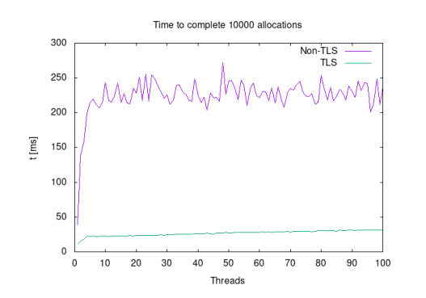
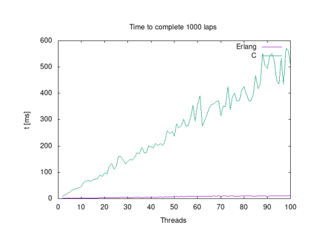
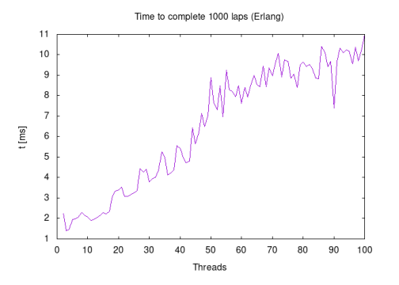

# jmalloc

This project was made as a part of a course in Operating Systems. The course work was carried out by me and one other student, where both development and documentation was distributed equally between the both of us and carried out together.

I have chosen to submit these files to demonstrate my understanding of Operating Systems, low level and systems programming, pointers, memory management and multi-threaded programs (with techniques as mutexes and locks), as well as demonstrate knowledge of the Functional programming paradigm using the language Erlang (part two of the project objective).

The project is split into two objectives; the first objective was to create our own simple implementation of `malloc`, a system level memory allocation call intended for multi-threaded use, and then to compare its performance using Thread Local Storage (TLS) with a central locked free-list. For reference, we named our implementation `jmalloc`. The second objective was to compare the performance of Operating System threads (i.e. threads managed by the operating system) to "Green Threads" (i.e. threads managed by the program itself) in a test program where a token is passed in a circle between a number of threads.

## Usage

### jmalloc

To compile and run the jmalloc bench program, use the makefile:

`make run_

`jmalloc`: A `malloc()` for multi-threaded use in order to compare the performance when using _Thread Local Storage_ (TLS) for the free-list and when using a central locked free-list.

`token`: A comparison between _OS threads_ (C) and _green threads_ (Erlang), where threads pass a token around in a loop.

